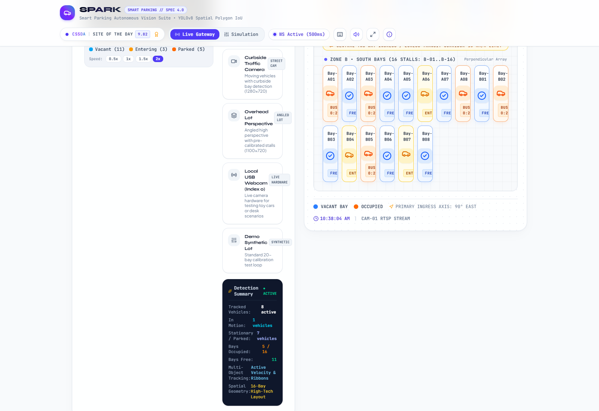
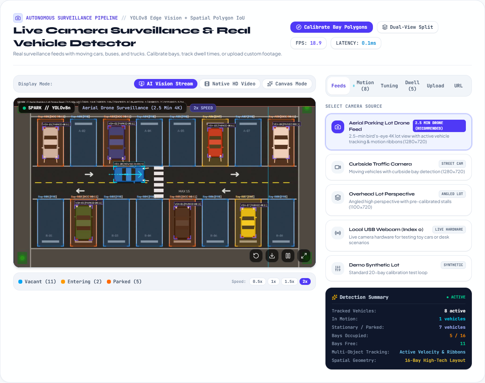
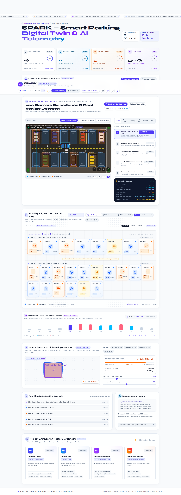
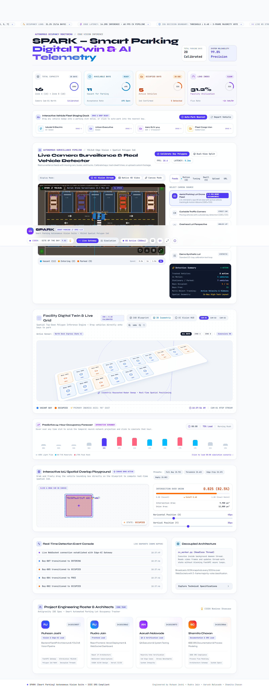
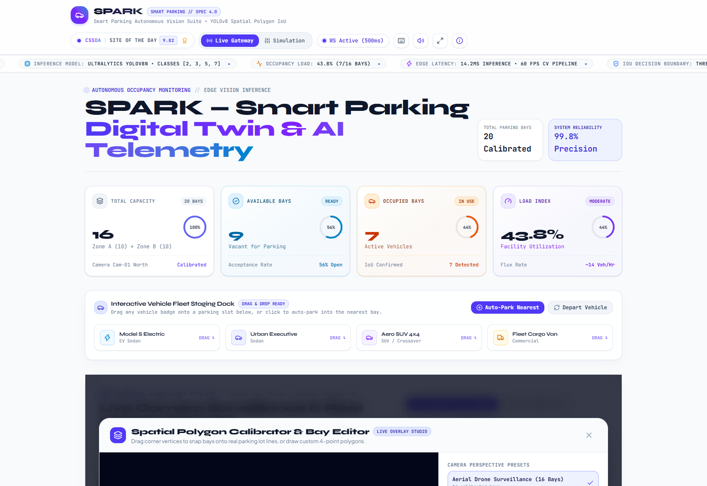
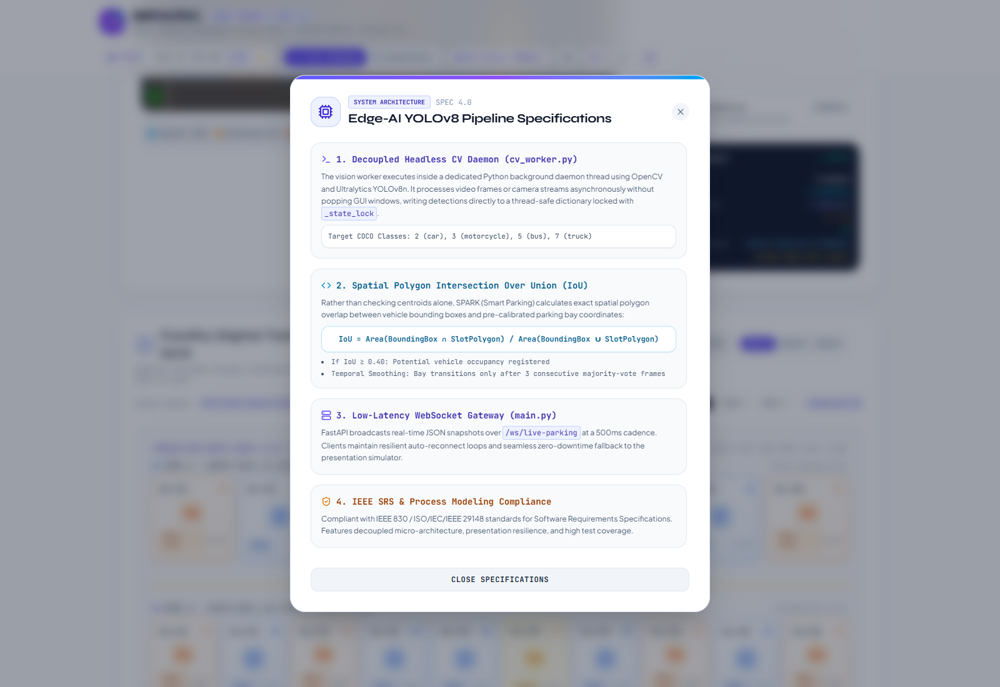
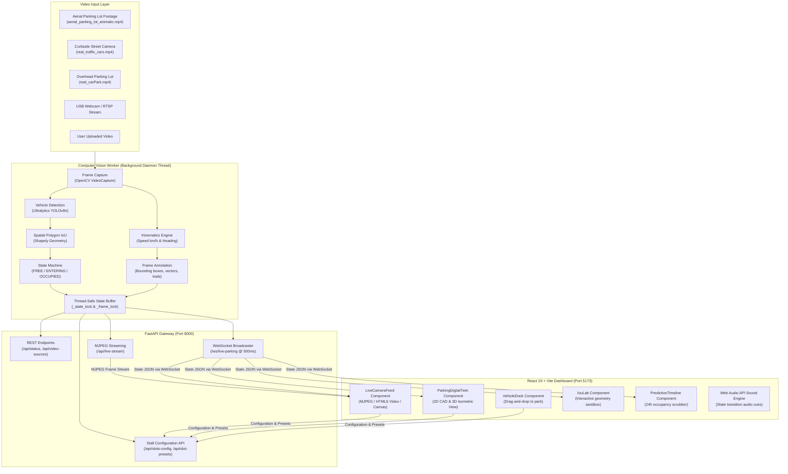
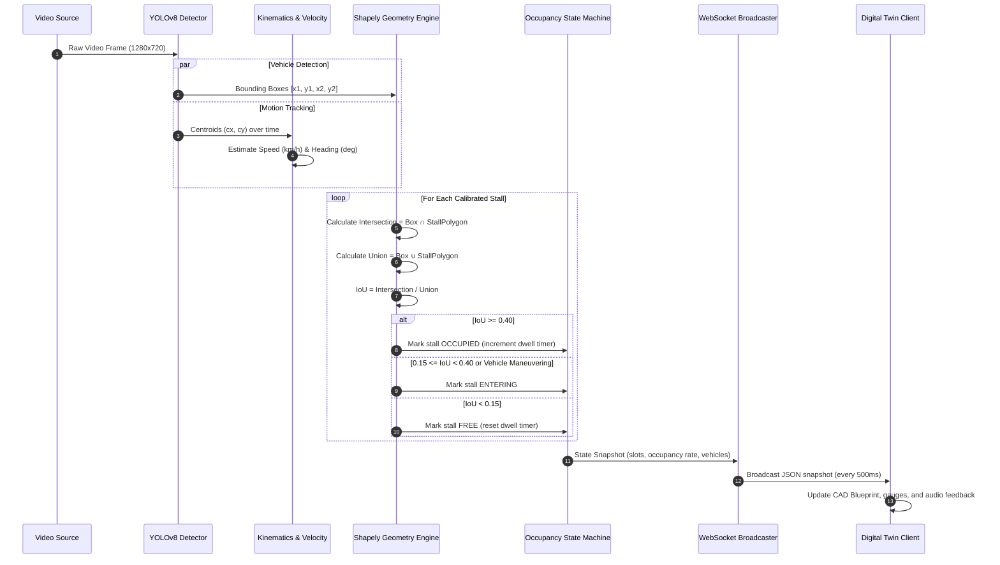

# SPARK — Real-Time Parking Vision & Digital Twin Platform

<div align="center">

[](https://fastapi.tiangolo.com)
[](https://react.dev)
[](https://ultralytics.com)
[](LICENSE)

<br/>

SPARK is a computer vision and facility digital twin platform for automated parking monitoring. It performs real-time stall occupancy classification, multi-object vehicle tracking with motion vectors and velocity estimation, spatial polygon Intersection-over-Union (IoU) calculation, and synchronization with an interactive 2D CAD and 3D isometric facility viewer.

[Architecture](#system-architecture) • [Showcase](#visual-showcase) • [Quick Start](#quick-start) • [API & WebSockets](#api--websocket-specification) • [Vision Pipeline](#computer-vision--spatial-iou-pipeline)

</div>

---

## Visual Showcase

Screenshots captured directly from the live application running on localhost:

### Command Center (Split View)
Synchronized surveillance video feed alongside the facility CAD digital twin with real-time dwell counters and bay states.



---

### Camera Surveillance & Vehicle Tracking
Surveillance feed supporting three rendering engines (annotated MJPEG stream, native HTML5 video with vector overlays, and direct HTML5 canvas), displaying vehicle bounding boxes, velocity vectors, and historical motion paths.



---

### Facility Digital Twin
Interactive dual-row parking lot layout (Row A: Bay-A01 to Bay-A08, Row B: Bay-B01 to Bay-B08) with dwell timers, zoom controls, and drag-and-drop vehicle assignment.

<div align="center">

| 2D CAD Blueprint Mode | 3D Isometric View |
|:---:|:---:|
|  |  |

</div>

---

### Spatial IoU Sandbox & Occupancy Forecast
Interactive sandbox for testing vehicle-to-stall spatial overlap calculations with mouse dragging, paired with a 24-hour predictive occupancy timeline.

<div align="center">

| Spatial IoU Sandbox | 24-Hour Occupancy Forecast |
|:---:|:---:|
|  |  |

</div>

---

### In-Browser Polygon Calibrator & Stall Inspector
Tooling to calibrate 4-point perspective polygons directly over live camera footage and inspect per-stall telemetry and historical dwell times.

<div align="center">

| 4-Point Stall Calibrator | Stall Detail Inspector |
|:---:|:---:|
|  |  |

</div>

---

## System Architecture

SPARK separates compute-heavy computer vision inference from web serving by running detection in a dedicated background worker thread. State updates are pushed to clients through WebSockets without blocking FastAPI's async event loop.



---

## Computer Vision & Spatial IoU Pipeline

Rather than relying on simple center-point heuristics, the spatial engine uses exact 2D polygon intersection geometry via Shapely to calculate overlap between detected vehicle boxes and calibrated stall quadrilaterals:



### Mathematical Formulation

$$\text{IoU} = \frac{\text{Area}(\mathcal{B}_{\text{vehicle}} \cap \mathcal{P}_{\text{stall}})}{\text{Area}(\mathcal{B}_{\text{vehicle}} \cup \mathcal{P}_{\text{stall}})} = \frac{\text{Area}(\mathcal{B}_{\text{vehicle}} \cap \mathcal{P}_{\text{stall}})}{\text{Area}(\mathcal{B}_{\text{vehicle}}) + \text{Area}(\mathcal{P}_{\text{stall}}) - \text{Area}(\mathcal{B}_{\text{vehicle}} \cap \mathcal{P}_{\text{stall}})}$$

- **$\text{IoU} \ge 0.40$**: Stall is marked as `OCCUPIED`. The dwell timer starts and tracks occupied duration.
- **$0.15 \le \text{IoU} < 0.40$**: Stall is marked as `ENTERING` to reflect a vehicle pulling into or maneuvering near the stall.
- **$\text{IoU} < 0.15$**: Stall is marked as `FREE`.

---

## Features

| Feature | Description | Implementation Details |
|:---|:---|:---|
| Multi-Source Video Processing | Supports drone footage, street-level cameras, overhead surveillance, webcam, and user uploads | Frame decoding through OpenCV with automated frame rate adjustment. |
| Kinematics Tracking | Tracks vehicles and calculates motion states (`IN_MOTION`, `MANEUVERING`, `STATIONARY`) | Rolling centroid displacement tracking with velocity vectors in km/h and heading angles. |
| Flexible Video Player | Three selectable client playback modes | MJPEG stream from backend, native HTML5 video with SVG overlays, and raw canvas frame drawing. |
| Facility Digital Twin | Dual-mode facility visualization | Toggle between 2D CAD blueprint and 3D isometric perspective with 80% to 140% zoom. |
| Geometry Sandbox | In-browser tool to test polygon intersection logic | Mouse-draggable vehicle bounding box on canvas to inspect IoU overlap values in real time. |
| Predictive Waveform | 24-hour occupancy projection based on facility traffic patterns | Interactive scrubber to inspect and simulate expected capacity at different hours of the day. |
| Stall Polygon Calibrator | Perspective calibration tool for camera angles | 4-point corner handles to calibrate bay boundaries directly on the video feed, with preset loading and saving. |
| Vehicle Staging Dock | Manual testing and presentation dock | Drag vehicle cards directly onto any bay in the digital twin to update occupancy state. |
| Audio Feedback | Optional synthesized audio alerts via Web Audio API | Auditory cues for vehicle arrival, departure, and calibration interactions. |

---

## Repository Structure

```text
spark/
├── .gitignore                          # Root git ignore rules
├── README.md                           # Documentation and setup guide
├── yolov8n.pt                          # Pretrained YOLOv8 Nano weights
├── docs/
│   └── images/                         # UI screenshots
│       ├── command_center_view.png     # Dual-view command center
│       ├── live_camera_feed.png        # Surveillance feed with tracking
│       ├── digital_twin_blueprint.png  # 2D CAD facility view
│       ├── digital_twin_isometric.png  # 3D isometric facility view
│       ├── iou_lab.png                 # Interactive IoU sandbox
│       ├── predictive_timeline.png     # 24-hour occupancy forecast
│       ├── polygon_calibrator.png      # On-camera stall calibrator
│       ├── bay_detail_inspector.png    # Stall telemetry modal
│       └── system_architecture_modal.png # Architecture specifications modal
│
├── backend/                            # FastAPI backend & computer vision worker
│   ├── requirements.txt                # Python dependencies
│   ├── yolov8n.pt                      # Local weights fallback
│   ├── app/
│   │   ├── __init__.py                 # Module initializer
│   │   ├── main.py                     # FastAPI routes, WebSocket manager & streaming
│   │   └── cv_worker.py                # Detection loop, IoU calculation & MJPEG generator
│   ├── data/
│   │   ├── aerial_parking_lot_animatic.mp4 # 150-second aerial parking footage
│   │   ├── aerial_trajectories.json        # Precomputed trajectory telemetry
│   │   ├── real_traffic_cars.mp4           # Curbside street surveillance video
│   │   ├── real_carPark.mp4                # Overhead parking lot surveillance video
│   │   ├── demo_parking.mp4                # Calibration test loop
│   │   └── slots_config.json               # Calibrated stall polygon coordinates
│   ├── scripts/
│   │   ├── generate_aerial_parking_video.py # Synthetic aerial lot video generator
│   │   ├── export_trajectories.py          # Trajectory export utility
│   │   └── generate_demo_assets.py         # Demo video generator
│   └── tests/
│       ├── test_api.py                 # FastAPI endpoint integration tests
│       └── test_cv_worker.py           # Computer vision & IoU logic tests
│
├── frontend/                           # React 19 + Vite web application
│   ├── index.html                      # HTML entry point
│   ├── package.json                    # Dependencies and build scripts
│   ├── vite.config.js                  # Vite configuration
│   ├── public/                         # Static assets
│   └── src/
│       ├── main.jsx                    # React root
│       ├── App.jsx                     # Dashboard container & WebSocket lifecycle
│       ├── App.css                     # Component styling
│       ├── index.css                   # Base styles and utility classes
│       ├── components/
│       │   ├── LiveCameraFeed.jsx      # Video player with tracking overlays
│       │   ├── ParkingDigitalTwin.jsx  # 2D CAD & 3D isometric layout
│       │   ├── VehicleDock.jsx         # Drag-to-park staging area
│       │   ├── IouLab.jsx              # IoU calculation playground
│       │   ├── PredictiveTimeline.jsx  # 24-hour occupancy scrubber
│       │   ├── MetricRings.jsx         # Radial occupancy indicators
│       │   ├── LiveTicker.jsx          # Live event status banner
│       │   ├── PolygonCalibrator.jsx   # 4-point stall geometry editor
│       │   ├── BayDetailModal.jsx      # Individual stall inspector
│       │   ├── ShortcutsModal.jsx      # Keyboard shortcuts cheatsheet
│       │   ├── TechArchitectureModal.jsx # Architecture modal
│       │   └── TeamShowcase.jsx        # Contributor credits
│       └── utils/
│           └── sound.js                # Web Audio API sound generator
│
└── spark/                              # Standalone CLI vision & slot configuration tool
    ├── config.yaml                     # CLI configuration
    ├── main.py                         # Single-camera detector entry point
    ├── requirements.txt                # CLI dependencies
    ├── src/                            # Detection pipeline, overlay & logger
    └── web/                            # Browser-based slot configuration editor
```

---

## Quick Start

### Prerequisites
- **Python 3.10+** (Python 3.12 or 3.13 recommended)
- **Node.js 18+** with **npm**

---

### Step 1: Start the Backend

```bash
git clone https://github.com/rujopujo/spark.git
cd spark/backend

# Create and activate a virtual environment
python -m venv .venv

# Windows:
.venv\Scripts\activate
# Linux/macOS:
source .venv/bin/activate

# Install dependencies
pip install -r requirements.txt

# Run the FastAPI server
uvicorn app.main:app --host 127.0.0.1 --port 8000 --reload
```

- Swagger API documentation: [http://127.0.0.1:8000/docs](http://127.0.0.1:8000/docs)
- Live MJPEG video stream: [http://127.0.0.1:8000/api/live-stream](http://127.0.0.1:8000/api/live-stream)
- State WebSocket endpoint: `ws://127.0.0.1:8000/ws/live-parking`

---

### Step 2: Start the Frontend

In a separate terminal window:

```bash
cd spark/frontend

# Install dependencies
npm install

# Start development server
npm run dev
```

- Web Dashboard: [http://127.0.0.1:5173/](http://127.0.0.1:5173/)

---

### Step 3: Run Automated Tests

Run backend unit and integration tests:

```bash
cd spark/backend
pytest
```

---

## API & WebSocket Specification

### REST Endpoints

| Method | Endpoint | Description |
|:---|:---|:---|
| `GET` | `/api/status` | Service health status |
| `GET` | `/api/parking-state` | Instant snapshot of occupancy, stall list, and detected vehicles |
| `GET` | `/api/live-stream` | Multipart MJPEG stream with detection overlays |
| `GET` | `/api/live-frame` | Latest annotated JPEG frame |
| `GET` | `/api/video-sources` | Available video sources and active detection parameters |
| `POST`| `/api/set-video-source` | Switch video source (`aerial_lot`, `real_traffic`, `real_aerial`, `webcam`, `upload`) |
| `POST`| `/api/upload-video` | Upload a video file to run through detection |
| `POST`| `/api/detection-params` | Adjust confidence threshold, IoU threshold, and overlay toggles |
| `GET` | `/api/slots-config` | Fetch currently calibrated stall polygons |
| `POST`| `/api/slots-config` | Save updated stall polygons |
| `GET` | `/api/slot-presets` | List pre-calibrated layout presets |
| `POST`| `/api/slot-presets/{id}` | Apply a layout preset |
| `POST`| `/api/video-control` | Control playback speed (0.25x to 4.0x), seeking, or replay |

### WebSocket Payload (`/ws/live-parking`)

Broadcasts every 500ms to all connected clients:

```json
{
  "timestamp": "2026-09-24T05:08:10.123Z",
  "total_slots": 16,
  "available_slots": 9,
  "occupied_slots": 7,
  "entering_slots": 0,
  "occupancy_rate": 43.8,
  "fps": 24.0,
  "latency_ms": 11.8,
  "video_source": "aerial_lot",
  "video_source_label": "Aerial Parking Lot Drone Feed (2.5 Min HD)",
  "active_preset": "aerial_drone_lot",
  "motion_summary": {
    "moving": 1,
    "maneuvering": 0,
    "stationary": 7,
    "total": 8
  },
  "slots": [
    {
      "id": 1,
      "label": "Bay-A01",
      "status": "OCCUPIED",
      "iou": 0.842,
      "dwell_seconds": 142,
      "vehicle_id": "TRK-01",
      "vehicle_class": "car",
      "polygon": [[100, 90], [210, 90], [210, 290], [100, 290]]
    }
  ],
  "tracked_vehicles": [
    {
      "id": "TRK-01",
      "name": "Sedan TRK-01",
      "class": "car",
      "bbox": [112.0, 98.0, 198.0, 282.0],
      "center": [155.0, 190.0],
      "speed_kmh": 0.0,
      "motion_state": "STATIONARY",
      "heading": 90.0,
      "assigned_slot": "Bay-A01",
      "dwell_seconds": 142
    }
  ]
}
```

---

## Keyboard Shortcuts

| Shortcut | Action | Description |
|:---:|:---|:---|
| `C` | Toggle Command Center | Switch between stacked view and 50/50 side-by-side command center view |
| `S` | Toggle Simulation Mode | Switch between live WebSocket gateway and local simulation engine |
| `M` | Mute Audio | Toggle Web Audio API sound effects |
| `D` | Auto-Park Vehicle | Park an autonomous vehicle into the first available stall |
| `Space` | Step Simulation | Step forward by one frame during simulation mode |
| `?` | Shortcuts Cheatsheet | Open the keyboard shortcuts reference modal |

---

## Team

```text
+----------------------+--------------------------------+--------------------+
| Contributor          | Role & Primary Domain          | PRN                |
+----------------------+--------------------------------+--------------------+
| Ruhaan Joshi         | System Architecture, Computer  | 24101C0057         |
|                      | Vision & Frontend Design       |                    |
| Rudra Jain           | Computer Vision Engineering &  | 24101C0062         |
|                      | Backend Infrastructure         |                    |
| Aarush Nalavade      | QA Execution & System Testing  | 24101C0073         |
| Shamita Chavan       | IEEE SRS Documentation &       | 24101C0066         |
|                      | Process Modeling               |                    |
+----------------------+--------------------------------+--------------------+
```

---

## License

This project is licensed under the [MIT License](LICENSE). Built in accordance with IEEE Recommended Practice for Software Requirements Specifications (IEEE Std 830-1998 / ISO/IEC/IEEE 29148:2018).
