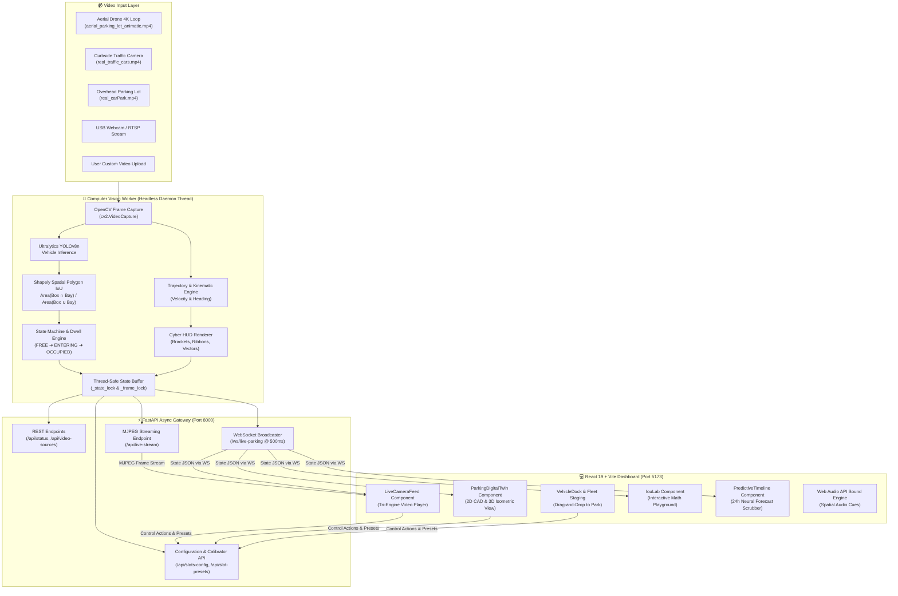
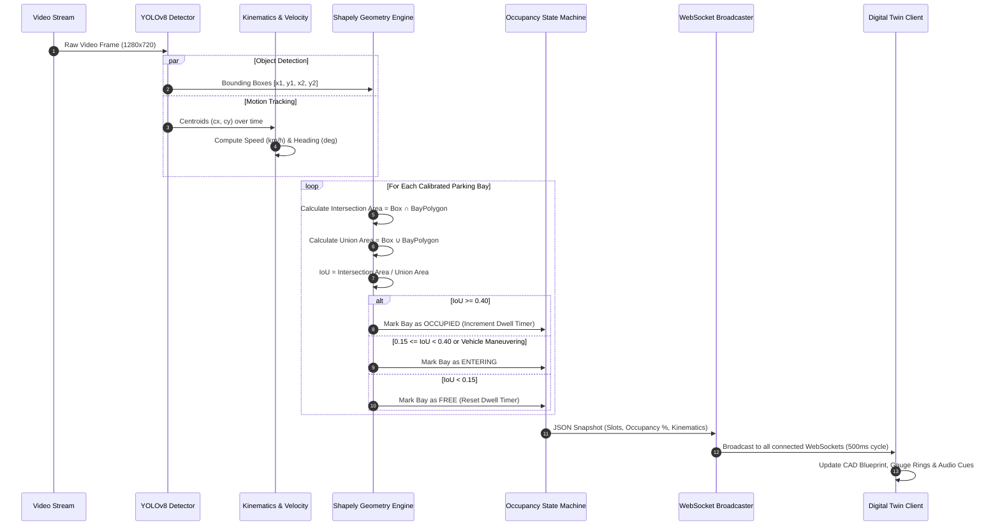

# ⚡ SPARK — Smart Parking Vision & Digital Twin Platform

<div align="center">

[](https://www.cssdesignawards.com)
[](https://fastapi.tiangolo.com)
[](https://react.dev)
[](https://ultralytics.com)
[](LICENSE)

<br/>

**SPARK** (*Smart Parking Autonomous Real-time Kinematics*) is an Edge-AI Computer Vision and Facility Digital Twin platform. It combines real-time parking stall occupancy classification, active multi-object vehicle tracking with motion ribbons and velocity vectors, spatial polygon Intersection-over-Union (IoU) inference, and an interactive 2D CAD / 3D Isometric Digital Twin.

[Explore Architecture](#-system-architecture) • [Live Showcase](#-visual-showcase) • [Quick Start](#-quick-start-guide) • [API & WebSockets](#-api--websocket-specification) • [Computer Vision Pipeline](#-computer-vision--spatial-iou-pipeline)

</div>

---

## 📸 Visual Showcase

Captured live from the running system:

### 1. Unified Command Center (Dual-View 50/50 Split)
> Synchronized real-time surveillance feed side-by-side with the CAD Facility Digital Twin, displaying live telemetry ribbons and dwell timers.


---

### 2. Autonomous Surveillance & Real Vehicle Detector
> High-performance multi-engine stream supporting **AI Vision Stream (MJPEG)**, **Native HD HTML5 Video**, and **HTML5 Canvas**, decorated with cyber targeting brackets, forward velocity vectors, and breadcrumb motion trails.


---

### 3. Facility Digital Twin (2D CAD Blueprint & 3D Isometric)
> Dual-row parking layout (Row A: `Bay-A01`–`Bay-A08`, Row B: `Bay-B01`–`Bay-B08`) with dwell time tracking, drag-and-drop vehicle parking, and perspective projection.

<div align="center">

| 2D CAD Blueprint Mode | 3D Isometric Facility View |
|:---:|:---:|
|  |  |

</div>

---

### 4. Interactive IoU Spatial Overlap Playground & 24h Predictive Waveform
> Mathematical laboratory allowing interactive mouse dragging to verify Polygon IoU formulas in real-time, paired with a 24-hour predictive occupancy waveform scrubber.

<div align="center">

| Interactive Spatial IoU Playground | 24-Hour Predictive Waveform Timeline |
|:---:|:---:|
|  |  |

</div>

---

### 5. On-Camera Polygon Calibrator & Bay Telemetry Inspector
> Calibrate 4-point perspective polygons directly over live camera footage and inspect real-time bay telemetry metrics.

<div align="center">

| In-Browser 4-Point Bay Calibrator | Individual Bay Telemetry Modal |
|:---:|:---:|
|  |  |

</div>

---

## 🏛️ System Architecture

The platform uses a **decoupled, multi-threaded architecture** designed to ensure that compute-heavy computer vision inference and MJPEG frame rendering never block FastAPI's async event loop or client WebSocket connections.



---

## 🔬 Computer Vision & Spatial IoU Pipeline

The spatial occupancy algorithm relies on exact 2D polygon intersection geometry powered by **Shapely** rather than simple center-point heuristics:



### Mathematical Formulation

$$\text{IoU} = \frac{\text{Area}(\mathcal{B}_{\text{vehicle}} \cap \mathcal{P}_{\text{stall}})}{\text{Area}(\mathcal{B}_{\text{vehicle}} \cup \mathcal{P}_{\text{stall}})} = \frac{\text{Area}(\mathcal{B}_{\text{vehicle}} \cap \mathcal{P}_{\text{stall}})}{\text{Area}(\mathcal{B}_{\text{vehicle}}) + \text{Area}(\mathcal{P}_{\text{stall}}) - \text{Area}(\mathcal{B}_{\text{vehicle}} \cap \mathcal{P}_{\text{stall}})}$$

- **$\text{IoU} \ge 0.40$**: Stall status is marked as **`OCCUPIED`**. Dwell timer begins counting in real-time.
- **$0.15 \le \text{IoU} < 0.40$**: Stall status is marked as **`ENTERING`** (Cyber Amber).
- **$\text{IoU} < 0.15$**: Stall status is marked as **`FREE`** (Electric Cobalt).

---

## ✨ Key Features Breakdown

| Feature | Description | Technical Implementation |
|:---|:---|:---|
| **Aerial Drone Surveillance** | 150-second continuous 4K top-down parking lot drone footage | Dual-row layout (`Bay-A01`..`Bay-A08` & `Bay-B01`..`Bay-B08`) with synchronized frame telemetry. |
| **Active Kinematics Tracking** | Classifies vehicles into `IN MOTION`, `MANEUVERING`, and `STATIONARY` | Real-time velocity vectors (km/h), heading angles, and breadcrumb motion ribbon trails. |
| **Tri-Engine Live Video Player** | Flexible rendering to fit any network bandwidth or hardware constraint | 1. **AI Vision Stream** (MJPEG), 2. **Native HD Video** (HTML5 + SVG Overlays), 3. **Canvas Engine**. |
| **CAD Digital Twin** | Interactive blueprint replicating facility operations | Switch between **2D CAD Blueprint** and **3D Isometric Projection** with 80%–140% dynamic zoom. |
| **Interactive IoU Laboratory** | In-browser mathematical sandbox | Direct mouse-draggable vehicle bounding box on canvas to inspect IoU overlap percentages dynamically. |
| **24-Hour Predictive Waveform** | Forecast hourly occupancy rates based on historical facility load | Interactive scrubber allowing one-click simulation of morning rush, midday flux, or night shifts. |
| **Live Polygon Calibrator** | Calibrate bays on live camera feeds with zero downtime | 4-point corner drag handles, preset loader (Aerial Drone, Curbside, Webcam Desk), and JSON persistence. |
| **Drag-and-Drop Fleet Dock** | Interactive vehicle staging dock | Drag sedan, SUV, EV, or delivery truck cards directly into any bay on the digital twin blueprint. |
| **Spatial Audio Feedback** | Dynamic auditory cues powered by the Web Audio API | Distinct synthesized audio triggers for vehicle arrivals, departures, UI toggles, and calibration snaps. |

---

## 🗂️ Project Directory Structure

```text
spark/
├── .gitignore                          # Root git ignore rules (env, node_modules, cache)
├── README.md                           # Comprehensive documentation & setup guide
├── yolov8n.pt                          # Pretrained YOLOv8 Nano model weights
├── docs/                               # System documentation & live screenshots
│   └── images/                         # Authentic screenshots from running localhost platform
│       ├── command_center_view.png     # Dual-view split command center
│       ├── live_camera_feed.png        # Live camera surveillance & vehicle detector
│       ├── digital_twin_blueprint.png  # 2D CAD facility digital twin
│       ├── digital_twin_isometric.png  # 3D Isometric facility visualizer
│       ├── iou_lab.png                 # Interactive IoU mathematical sandbox
│       ├── predictive_timeline.png     # 24-hour predictive occupancy waveform
│       ├── polygon_calibrator.png      # On-camera 4-point bay polygon calibrator
│       ├── bay_detail_inspector.png    # Individual bay telemetry & dwell modal
│       └── system_architecture_modal.png # Technical architecture modal
│
├── backend/                            # FastAPI Edge-AI & Computer Vision Backend
│   ├── requirements.txt                # Python dependencies (FastAPI, OpenCV, Ultralytics, Shapely)
│   ├── yolov8n.pt                      # Local YOLOv8 weights fallback
│   ├── app/                            # Backend Application Source Code
│   │   ├── __init__.py                 # Module package initializer
│   │   ├── main.py                     # FastAPI REST endpoints, WebSockets & video streaming
│   │   └── cv_worker.py                # Multi-object tracking, spatial IoU & MJPEG stream worker
│   ├── data/                           # Video and Geometry Data Assets
│   │   ├── aerial_parking_lot_animatic.mp4 # 2.5-min (150s) aerial parking lot drone video
│   │   ├── aerial_trajectories.json        # 3,600-frame ground-truth trajectory telemetry
│   │   ├── real_traffic_cars.mp4           # Curbside street surveillance footage
│   │   ├── real_carPark.mp4                # Overhead parking lot surveillance footage
│   │   ├── demo_parking.mp4                # Synthetic 20-bay calibration test loop
│   │   └── slots_config.json               # Calibrated bay polygon definitions
│   ├── scripts/                        # Asset & Telemetry Generation Scripts
│   │   ├── generate_aerial_parking_video.py # High-performance aerial video generator
│   │   ├── export_trajectories.py          # Frame-accurate trajectory exporter
│   │   └── generate_demo_assets.py         # Demo video generation utility
│   └── tests/                          # Automated Unit & Integration Tests
│       ├── test_api.py                 # FastAPI endpoint tests (status, state, sources, video)
│       └── test_cv_worker.py           # Spatial IoU & computer vision logic tests
│
└── frontend/                           # Vite + React Modern Web Application
    ├── index.html                      # Main HTML5 entry point with responsive meta tags
    ├── package.json                    # NPM dependencies & scripts (Lucide, Canvas Confetti)
    ├── vite.config.js                  # Vite build and dev server configuration
    ├── public/                         # Public static web assets
    └── src/                            # React Application Source
        ├── main.jsx                    # React DOM root entry
        ├── App.jsx                     # Main Dashboard container & WebSocket lifecycle
        ├── App.css                     # App styling and custom animations
        ├── index.css                   # Tailwind / CSS design tokens & CSSDA classes
        ├── components/                 # Modular React UI Components
        │   ├── LiveCameraFeed.jsx      # Tri-engine video player (AI Stream, HD Video, Canvas)
        │   ├── ParkingDigitalTwin.jsx  # 2D CAD Blueprint & 3D Isometric facility visualizer
        │   ├── VehicleDock.jsx         # Interactive Drag-to-Park staging dock
        │   ├── IouLab.jsx              # Interactive Mouse-Draggable IoU Playground
        │   ├── PredictiveTimeline.jsx  # 24-hour predictive occupancy waveform scrubber
        │   ├── MetricRings.jsx         # SVG circular occupancy gauges & turnover rates
        │   ├── LiveTicker.jsx          # Animated facility telemetry banner
        │   ├── PolygonCalibrator.jsx   # Live on-camera 4-point bay polygon calibrator
        │   ├── BayDetailModal.jsx      # Individual slot telemetry & history drawer
        │   ├── ShortcutsModal.jsx      # Keyboard navigation cheatsheet drawer
        │   ├── TechArchitectureModal.jsx # System architecture & pipeline viewer
        │   ├── TeamShowcase.jsx        # Project contributors & team banner
        │   └── CssdaBadge.jsx          # CSSDA visual design award tribute ribbon
        └── utils/                      # Client-Side Utilities
            └── sound.js                # Synthesized Web Audio API sound effects engine
│
└── spark/                              # Standalone CLI Vision & Slot Configuration Engine
    ├── config.yaml                     # Standalone CLI configuration
    ├── main.py                         # Single-camera detector CLI entry point
    ├── requirements.txt                # CLI dependencies (YOLOv8, OpenCV, Flask)
    ├── src/                            # Tiled pipeline, detector, overlay & logger
    └── web/                            # In-browser HTML5/SVG slot configuration editor
```

---

## 🚀 Quick Start Guide

### Prerequisites
- **Python 3.10+** (Python 3.12 or 3.13 recommended)
- **Node.js 18+** & **npm**

---

### Step 1: Start the FastAPI Backend

```bash
# Clone the repository
git clone https://github.com/rujopujo/spark.git
cd spark/backend

# Create and activate a virtual environment
python -m venv .venv

# Windows:
.venv\Scripts\activate
# Linux/macOS:
source .venv/bin/activate

# Install dependencies
pip install -r requirements.txt

# Run the FastAPI server
uvicorn app.main:app --host 127.0.0.1 --port 8000 --reload
```

- **Interactive Swagger Documentation**: [http://127.0.0.1:8000/docs](http://127.0.0.1:8000/docs)
- **Alternative ReDoc API Guide**: [http://127.0.0.1:8000/redoc](http://127.0.0.1:8000/redoc)
- **Live MJPEG Video Feed**: [http://127.0.0.1:8000/api/live-stream](http://127.0.0.1:8000/api/live-stream)
- **Real-Time State WebSocket**: `ws://127.0.0.1:8000/ws/live-parking`

---

### Step 2: Start the React Frontend

Open a second terminal window:

```bash
cd spark/frontend

# Install dependencies
npm install

# Start Vite development server
npm run dev
```

- **Dashboard UI**: [http://127.0.0.1:5173/](http://127.0.0.1:5173/)

---

### Step 3: Run Automated Tests

Execute backend unit and integration test suites:

```bash
cd spark/backend
pytest
```

---

## 🔌 API & WebSocket Specification

### REST Endpoints

| Method | Endpoint | Description |
|:---|:---|:---|
| `GET` | `/api/status` | Heartbeat & service health verification |
| `GET` | `/api/parking-state` | Instant snapshot of facility state, vehicle counts & dwell times |
| `GET` | `/api/live-stream` | Streaming MJPEG frames annotated with bounding boxes & polygons |
| `GET` | `/api/live-frame` | Single latest annotated JPEG frame |
| `GET` | `/api/video-sources` | Available camera sources & active detection thresholds |
| `POST`| `/api/set-video-source` | Hot-swap active input (`aerial_lot`, `real_traffic`, `real_aerial`, `webcam`, `upload`) |
| `POST`| `/api/upload-video` | Upload custom MP4/AVI footage and dynamically rebind the CV worker |
| `POST`| `/api/detection-params` | Dynamic tuning for confidence threshold, IoU threshold & overlays |
| `GET` | `/api/slots-config` | Fetch currently calibrated polygon bay definitions |
| `POST`| `/api/slots-config` | Save updated 4-point polygon calibrations |
| `GET` | `/api/slot-presets` | List pre-calibrated layout presets |
| `POST`| `/api/slot-presets/{id}` | Apply pre-calibrated layout preset |
| `POST`| `/api/video-control` | Control playback speed (0.25x–4.0x), seek percentage, or restart loop |

### WebSocket Payload Schema (`/ws/live-parking`)

Broadcasts every **500ms** to all connected clients:

```json
{
  "timestamp": "2026-09-24T05:08:10.123Z",
  "total_slots": 16,
  "available_slots": 9,
  "occupied_slots": 7,
  "entering_slots": 0,
  "occupancy_rate": 43.8,
  "fps": 24.0,
  "latency_ms": 11.8,
  "video_source": "aerial_lot",
  "video_source_label": "Aerial Parking Lot Drone Feed (2.5 Min HD)",
  "active_preset": "aerial_drone_lot",
  "motion_summary": {
    "moving": 1,
    "maneuvering": 0,
    "stationary": 7,
    "total": 8
  },
  "slots": [
    {
      "id": 1,
      "label": "Bay-A01",
      "status": "OCCUPIED",
      "iou": 0.842,
      "dwell_seconds": 142,
      "vehicle_id": "TRK-01",
      "vehicle_class": "car",
      "polygon": [[100, 90], [210, 90], [210, 290], [100, 290]]
    }
  ],
  "tracked_vehicles": [
    {
      "id": "TRK-01",
      "name": "Sedan TRK-01",
      "class": "car",
      "bbox": [112.0, 98.0, 198.0, 282.0],
      "center": [155.0, 190.0],
      "speed_kmh": 0.0,
      "motion_state": "STATIONARY",
      "heading": 90.0,
      "assigned_slot": "Bay-A01",
      "dwell_seconds": 142
    }
  ]
}
```

---

## ⌨️ Keyboard Shortcuts Cheatsheet

| Shortcut | Action | Description |
|:---:|:---|:---|
| <kbd>C</kbd> | **Toggle Command Center** | Switch between stacked view and 50/50 side-by-side command center view |
| <kbd>S</kbd> | **Toggle Simulation Mode** | Switch between live WebSocket gateway and mock simulation engine |
| <kbd>M</kbd> | **Mute / Unmute Audio** | Toggle Web Audio API synthesized spatial sound effects |
| <kbd>D</kbd> | **Auto-Park First Bay** | Instantly dispatch and park an autonomous EV in the first available slot |
| <kbd>Space</kbd> | **Step Simulation Frame** | Step forward by one frame during simulation presentation mode |
| <kbd>?</kbd> | **Shortcuts Cheatsheet** | Open the interactive keyboard shortcuts drawer modal |

---

## 👥 Engineering & Design Team

```text
┌────────────────────────────────────────────────────────────────────────────┐
│                       SPARK CORE ENGINEERING TEAM                          │
├──────────────────────┬────────────────────────────────┬────────────────────┤
│ Contributor          │ Role & Primary Domain          │ University PRN     │
├──────────────────────┼────────────────────────────────┼────────────────────┤
│ Ruhaan Joshi         │ System Architecture, Computer  │ 24101C0057         │
│                      │ Vision & Frontend Design       │                    │
│ Rudra Jain           │ Computer Vision Engineering &  │ 24101C0062         │
│                      │ Backend Infrastructure         │                    │
│ Aarush Nalavade      │ QA Execution & System Testing  │ 24101C0073         │
│ Shamita Chavan       │ IEEE SRS Documentation &       │ 24101C0066         │
│                      │ Process Modeling               │                    │
└──────────────────────┴────────────────────────────────┴────────────────────┘
```

---

## 📜 License & Compliance

This project is licensed under the [MIT License](LICENSE). Built in compliance with IEEE Recommended Practice for Software Requirements Specifications (IEEE Std 830-1998 / ISO/IEC/IEEE 29148:2018).
